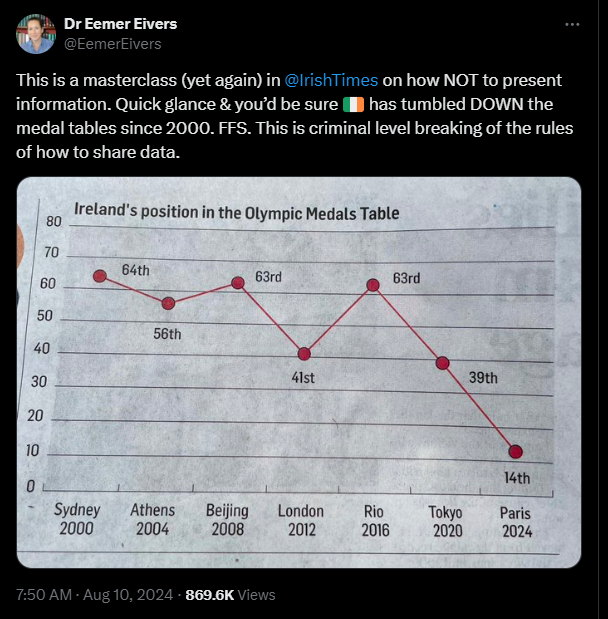

# 431 Class 02: 2025-09-04

[Main Website](https://thomaselove.github.io/431-2025/) | [Calendar](https://thomaselove.github.io/431-2025/calendar.html) | [Syllabus](https://thomaselove.github.io/431-syllabus-2025/) | [Text](https://thomaselove.github.io/431-book/) | [Contact Us](https://thomaselove.github.io/431-2025/contact.html) | [Canvas](https://canvas.case.edu) | [Data and Code](https://github.com/THOMASELOVE/431-data)
:-----------: | :--------------: | :----------: | :---------: | :-------------: | :-----------: | :------------:
for everything | for deadlines | expectations | from Dr. Love | get help | lab submission | for downloads

## Today's Opener: The Quick Survey

As you come in, **please take** (from the box at the back table) a paper survey with 15 questions. Please read these instructions carefully before writing anything down.

1. Introduce yourself to someone near you.
2. Record the survey answers **for that other person**, while they record your responses.
3. Be sure to complete all 15 questions (both sides of the paper).
4. When you are finished, thank your partner and raise your hand. Someone will come around to collect your survey.

There is a [PDF copy of the Quick Survey here](431_surveyhandout_1perstudent_2025-09-04.pdf), if you'd like to look at the form after your paper copy has been collected.

## Today's Slides

Class | Date | Slides | Word .docx | Quarto .qmd | Recording
:---: | :--------: | :------: | :------: | :------: | :-------------:
02 | 2025-09-04 | **[Slides 02](https://thomaselove.github.io/431-slides-2025/class02.html)** | **[Word 02](https://thomaselove.github.io/431-slides-2025/class02w.docx)** | **[Code 02](https://github.com/THOMASELOVE/431-slides-2025/blob/main/class02.qmd)** | Visit [Canvas](https://canvas.case.edu/), select **Zoom** and **Cloud Recordings**

- The HTML link provides the (RevealJS) version of the slides that I suggest you focus on during class.
- The Word link will let you download the material in the slides as a Word (.docx) document.
    - Some people prefer this to the HTML version for live note-taking.
- The Quarto file link provides the code I used (in [Quarto](https://quarto.org/)) to build the slides. Hit the download button after clicking the link above if you want the `.qmd` file.
- To print RevealJS slides **to pdf**, [follow these instructions](https://quarto.org/docs/presentations/revealjs/presenting.html#print-to-pdf) using Google Chrome as your browser.
- We attempt to record **most** 431 classes via Zoom and post the recording to Canvas.

## Announcements

1. If you want to get in touch with me outside of class, the best option is always to **email** me at `Thomas` dot `Love` at `case` dot `edu`.
    - If you find a typo or other error in any of our materials, email me, and I'll award some class participation credit if you're the first to let me know.
    - If you have a logistical question about how the course is set up, emailing me is also a good idea.
    - Most questions about software setup, statistical interpretation or R programming issues should be asked in [TA (Teaching Assistant) Office Hours](https://thomaselove.github.io/431-2025/contact.html#ta-office-hours) which started yesterday.
2. To access the Class recordings, visit [Canvas](https://canvas.case.edu/), select our course, then select *Zoom* and then *Cloud Recordings*. Select the recording you want to view, and you should then be able to either download it or watch it online. 
3. Thank you to Dana Kleinman, Erin San Valentin, Hana Sato, Hannah Iqbal, Linda Chen, Leland Metheny, Moses Fleischman, Paulina Gonzalez, Swati Jha, Lily Zhang, and Vennila Ramasubramanian for filling out the Google Form for the age guessing activity in Class 01. I appreciate the help.
4. Mild changes were made since our last class to the [course syllabus](https://thomaselove.github.io/431-syllabus-2025/) to eliminate discussion of Campuswire, which we're not using this term (Thanks to Linda Chen), and I've added data sets about our Class 1 activities to [our 431-data site](https://github.com/THOMASELOVE/431-data).
5. We'll start demonstrating the use of R and RStudio in class 3, on Tuesday 2025-09-09.
6. A list of enrolled students in the class is posted to our Shared Google Drive as **Student Roster for 431 in Fall 2025**. Please check that the information posted there for you is complete and correct. Let me know via email if it is not.

## Some Thoughts on the Welcome to 431 Survey

can be found in this [Welcome to 431 Survey Report](welcome_report.md)

-------

## Your Questions, My Answers

- *Any tips for getting my hands on an affordable but high quality laptop?*
    - [CWRU provides these suggestions](https://case.edu/orientation/orientation-news/more-know/plan-ahead-your-technology-needs) which includes links to discount pricing at the UTech eStore.
- *Should I raise my hand and ask questions during class time, wait until after to ask in person or email you?*
    - The answer is yes, do all three.
    - In class, it's best to address immediate concerns based on what we're talking about.
    - Before or after class is best for more private matters that don't concern the rest of the group.
    - Email is always the best way to reach me outside of class. If you're not sure whether to send me an email or not, send it.
- *Will you extend any of the deadlines in the Calendar?*
    - Essentially, no. I will not. If this causes you concern, email me to describe the situation you have in mind.
- *Are you open to serving as a dissertation committee member?*
    - I'm happy to discuss that in December or later, and usually say yes to anyone who's demonstrated a meaningful interest in learning this material. If you need someone for this Fall, then probably not, no.
- *What is your biggest accomplishment as a statistician?*
    - I am proud of many achievements over the years, most especially those of my students. I have also been recognized with numerous awards, both for teaching, service and research work. The [syllabus section on me](https://thomaselove.github.io/431-syllabus-2025/07_professorlove.html) has more details.
- *In class 1, you mentioned that something has a disproportionate impact on your mood, but then didn't finish that thought. What did you have in mind?*
    - The [Mets](https://www.mlb.com/mets). I have been a fan of the New York Mets for 52 years. When they win, my life seems better. It's silly, but it's true. 

## Reminders (see [the Calendar](https://thomaselove.github.io/431-2025/calendar.html) for the final word on all deadlines)

- Attend [TA office hours](https://thomaselove.github.io/431-2025/contact.html#ta-office-hours) if you need help     
- Before Class 3 (2025-09-09)
    - Read *The Art of Statistics* by David Spiegelhalter, Introduction and Chapter 1
    - Read [R for Data Science](https://r4ds.hadley.nz/), Introduction and as much of the "Whole Game" as possible
    - Skim the [Project A instructions](https://thomaselove.github.io/431-projectA-2025/)
    - Read the [Lab 1 instructions](https://github.com/THOMASELOVE/431-labs-2025). The lab is due on Wednesday 2025-09-17 at noon.
    - Be sure you have R and R Studio loaded properly on your computer. Details on [our software page](https://thomaselove.github.io/431-2025/software.html).
- Next Week
    - [Minute Paper](https://github.com/THOMASELOVE/431-minute-2025/tree/main) after Class 03 will be posted in time for Class on Tuesday, and is due Wednesday at noon.    
- Before Class 5 (2025-09-16)
    - Read *The Art of Statistics* by David Spiegelhalter, Chapters 2-3
    - Read [R for Data Science](https://r4ds.hadley.nz/), the rest of the "Whole Game" (sections 1-8)
    - Get started on the [Project A data work](https://thomaselove.github.io/431-projectA-2025/)
    - Remember that [Lab 1](https://github.com/THOMASELOVE/431-labs-2025) is due on Wednesday 2025-09-17 at noon.

## One Last Thing

  [Link to Source](https://x.com/EemerEivers/status/1822239148519890981)
