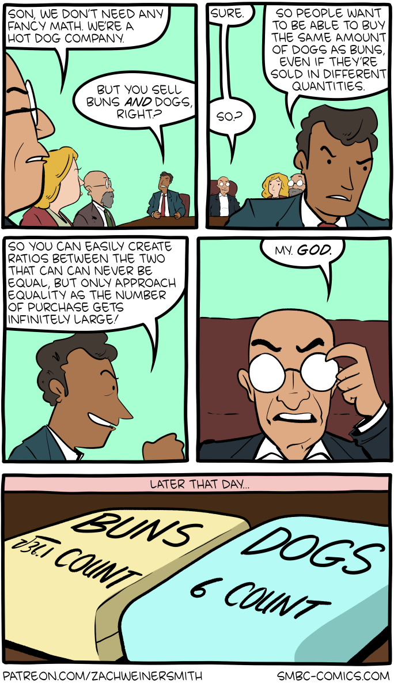

# 431 Class 03: 2025-09-09

[Main Website](https://thomaselove.github.io/431-2025/) | [Calendar](https://thomaselove.github.io/431-2025/calendar.html) | [Syllabus](https://thomaselove.github.io/431-syllabus-2025/) | [Text](https://thomaselove.github.io/431-book/) | [Contact Us](https://thomaselove.github.io/431-2025/contact.html) | [Canvas](https://canvas.case.edu) | [Data and Code](https://github.com/THOMASELOVE/431-data)
:-----------: | :--------------: | :----------: | :---------: | :-------------: | :-----------: | :------------:
for everything | for deadlines | expectations | from Dr. Love | get help | lab submission | for downloads

## Today's Slides

Class | Date | Slides | Word .docx | Quarto .qmd | Recording
:---: | :--------: | :------: | :------: | :------: | :-------------:
03 | 2025-09-09 | **[Slides 03](https://thomaselove.github.io/431-slides-2025/class03.html)** | **[Word 03](https://thomaselove.github.io/431-slides-2025/class03w.docx)** | **[Code 03](https://github.com/THOMASELOVE/431-slides-2025/blob/main/class03.qmd)** | Visit [Canvas](https://canvas.case.edu/), select **Zoom** and **Cloud Recordings**

- The HTML link provides the (RevealJS) version of the slides that I suggest you focus on during class.
- The Word link will let you download the material in the slides as a Word (.docx) document.
    - Some people prefer this to the HTML version for live note-taking.
- The Quarto file link provides the code I used (in [Quarto](https://quarto.org/)) to build the slides. Hit the download button after clicking the link above if you want the `.qmd` file.
- To print RevealJS slides **to pdf**, [follow these instructions](https://quarto.org/docs/presentations/revealjs/presenting.html#print-to-pdf) using Google Chrome as your browser.
- We attempt to record **most** 431 classes via Zoom and post the recording to Canvas.

## Announcements

1. Your next assignment is the [Minute Paper after Class 03](https://bit.ly/431-2025-minute-03), which you need to complete by NOON Wednesday 2025-09-10 (tomorrow). A Minute Paper is a short survey (completed using a Google Form) where you will answer a few questions about how the course is going for you. It shouldn't take more than 2-3 minutes to complete.
    - You'll need to be logged into Google via CWRU to complete the Minute Papers. 
    - **Always** complete the Minute Paper even if you weren’t able to attend the most recent class. 
    - More on the Minute Papers [here](https://github.com/THOMASELOVE/431-minute-2025), and [in the Syllabus](https://thomaselove.github.io/431-syllabus-2025/10_assignments.html#minute-papers).

2. 37/53 of you met the deadline for bonus credit related to the "Favorite Movie" activity in [Section 13 of the Syllabus](https://thomaselove.github.io/431-syllabus-2025/13_movies.html). The rest of you have responded to additional requests. Thanks.

3. If you’ve spent 15 minutes working on something and are stuck, don’t keep working on it. Step away for a while, and if you return and are still stuck, **ASK FOR HELP**.
    - Attend [TA office hours](https://thomaselove.github.io/431-2025/contact.html) to get one-on-one help or share a computer problem. Our Shared Google Drive (431 Fall 2025 Materials for Students and Dr. Love) contains Zoom links for TA office hours in a document called **TA office hours Schedule and Zoom links**. No appointment is necessary. Please just drop in.
    - Professor Love also holds "drop-in" office hours before and after each class.
    - Email Professor Love if you have any questions you don't feel comfortable asking in TA office hours.

4. Thanks to a pair of students for suggested fixes to typos in [the Course Book](https://thomaselove.github.io/431-book/). Since it takes a while for this to run, I aim to update it on Mondays, as needed. The latest version (updated yesterday) is now online.

5. I'd encourage you to [re-download the 431 data and code](https://github.com/THOMASELOVE/431-data?tab=readme-ov-file#getting-the-data-use-this-approach-if-possible) during or after today's class, since I've made some updates.
-------

## Today's Data: The 15 Question Survey, from Class 02

You may recall my mentioning that over the past ten years, 547 students had taken a version of our 15-item quick survey, and that 196/547 (36%) caused no problems in deciphering the results. The updated results through 2025 are 216/600 (still 36%), as the 2025 results were 20/53 (37.7%).

- I am roughly 6 feet 2.25 inches tall these days, which is about 188 cm. At my tallest, I was 6 feet 4 inches (193 cm), but I've shrunk.
- My answers to some of the other survey questions:
    - I don't wear glasses (except reading glasses on occasion). English is my best language. I have never smoked, not even on stage.
    - My handedness score is +0.5 (four plus marks on L and 12 on R), although, for example, I shoot pool better left-handed.
    - My last haircut cost me $45, including the tip. My favorite color is purple.
    - My hand span is just over 26 cm, which is the largest this year (and most years.)
    - I slept 6.5 hours the night before our class 02, and my pulse rate at the start of that class was 84 beats per minute.
- Changes to the survey over the years:
    - `glasses` item added in 2019, `love's height` added in 2021
    - `sex` asked in 2014-2018, `love's age` guessed in 2014-2019
    - `statssofar`, `handedness`, `pulse` rate and `hand_span` not included in 2020 (COVID-related modifications since the course was exclusively given through Zoom)

## Extra Materials for Class 03 found in the [Class 03 data subfolder](https://github.com/THOMASELOVE/431-classes-2025/tree/main/class03/data)

These items are also part of the updated [431-data page](https://github.com/THOMASELOVE/431-data).

- [431-first-r-template.qmd](data/431-first-r-template.qmd) is the **template** I will start with in developing today's materials.
- [431-class03-all-code.qmd](data/431-class03-allcode.qmd) is a revision of the template that includes all of the code I will develop today in [the slides](https://thomaselove.github.io/431-slides-2024/class03.html).
- [survey15_2014_to_2025.csv](data/survey15_2014_to_2025.csv) contains the data from our [15 item Survey in Class 02 (pdf)](https://github.com/THOMASELOVE/431-classes-2025/blob/main/class02/431_surveyhandout_1perstudent_2025-09-04.pdf) for you and for students in the 2014-2024 versions of 431.

### R Tools We'll Demonstrate Using Today's Materials

In addition to demonstrating general approaches for creating R projects and Quarto files, and loading R packages, we'll demonstrate most of the following key ideas...

1. Ingesting data with `read_csv()` from a csv (comma-separated version text) file to create a tibble (data frame.)
2. Six key verbs from the `tidyverse`: `count()`, `filter()`, `select()`, `mutate()`, `group_by()` and `summarize()`
3. Using the pipe: `|>` to push information through a pipeline.
4. Using the assignment operator `<-` to assign results to a variable or tibble or other sort of object.
5. Summarizing data with `summary()`, `tabyl()` and with `describe_distribution()`
6. Dealing with missing data via the creation of complete-case analyses with `filter(complete.cases())`
7. Converting categorical variables to factors with `as_factor())`
8. Building plots using `ggplot` and the `ggplot2` package
    - Setting the x and y variables with `aes()`
    - Using `geom_histogram()` to obtain histograms of quantities
    - Using `geom_boxplot()` and `geom_violin()` for comparisons of quantities across categories (groups)
    - Using `labs()` to set axis labels, main and sub-titles
9. Using `xfun::session_info()` to describe information about your installation of R at the end of your session.

All of this material is also demonstrated in Chapters 1-4 of the [Course Text](https://thomaselove.github.io/431-book/), and we will review (and augment) these ideas in class over the next few weeks.

---------

## Ten Interesting/Fun Facts about Students in this semester's 431 class

1. I love cats, especially my pet Sushi.
2. I love playing tactical role-playing games.
3. I manage a transgenic mouse colony.
4. I am a middle school speech and debate coach.
5. I am a red coat volunteer at Playhouse Square.
6. I am currently trying to set up a blacksmith shop.
7. According to the Japanese embassy, I am the only Japanese-Guatemalan in my birth cohort that holds both nationalities.
8. I cannot stand the cold, and yet, here I am in Cleveland.
9. I have done martial arts for 10 years.
10. I am a practicing orthodontist who has never had braces.

These come from the Welcome to 431 survey - some more results from that survey [can be found here](https://github.com/THOMASELOVE/431-classes-2025/blob/main/class02/welcome_report.md).

## Reminders (see [the Calendar](https://thomaselove.github.io/431-2025/calendar.html) for the final word on all deadlines)

- The [Minute Paper](https://github.com/THOMASELOVE/431-minute-2025/tree/main) after Class 03 will be posted in time for Class on Tuesday, and is due Wednesday (tomorrow) at noon.    
- Before Class 5 (2025-09-16)
    - Read *The Art of Statistics* by David Spiegelhalter, Chapters 2-3
    - Read [R for Data Science](https://r4ds.hadley.nz/), the rest of the "Whole Game" (sections 1-8)
    - Get started on the [Project A data work](https://thomaselove.github.io/431-projectA-2025/)
    - Remember that [Lab 1](https://github.com/THOMASELOVE/431-labs-2025) is due on Wednesday 2025-09-17 at noon.
- Attend [TA office hours](https://thomaselove.github.io/431-2025/contact.html#ta-office-hours) if you need help.     

## One Last Thing

- Source: [Saturday Morning Breakfast Cereal](http://www.smbc-comics.com/comic/dogs-4)

