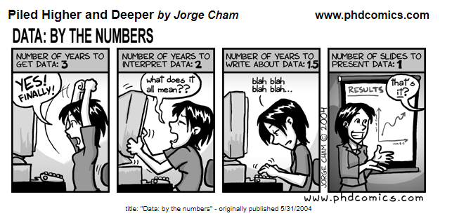
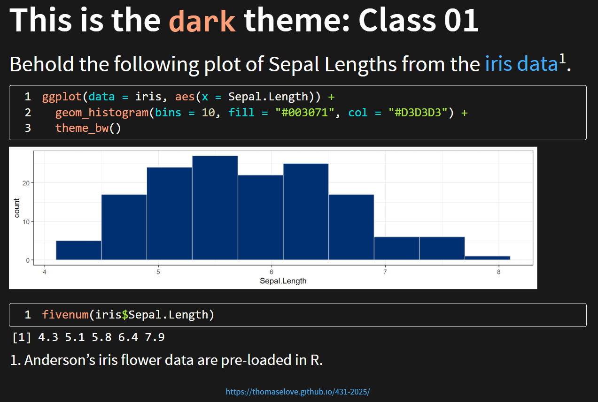
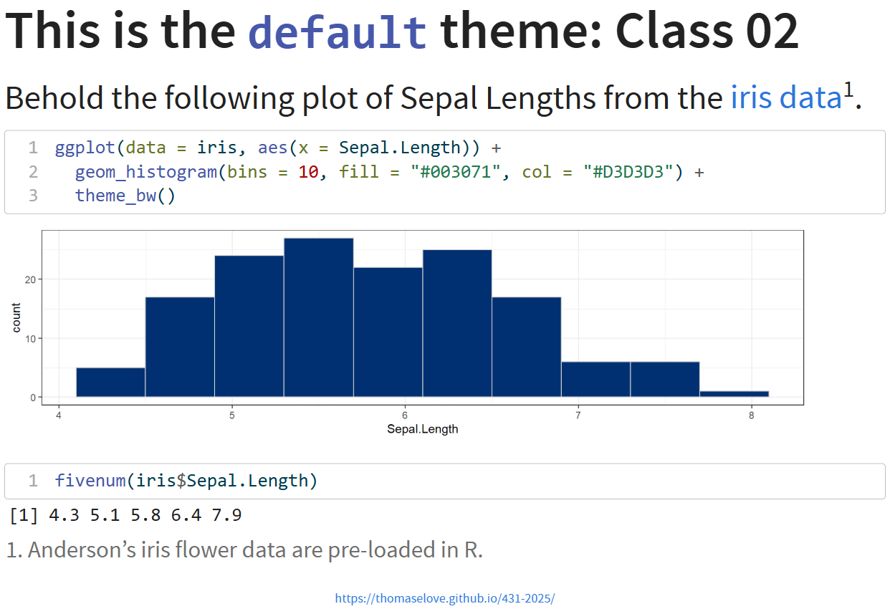
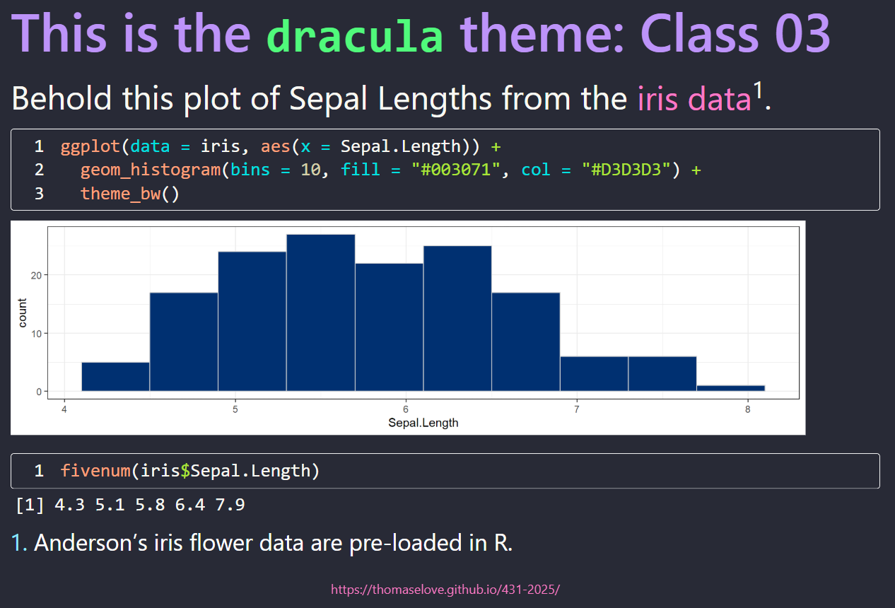
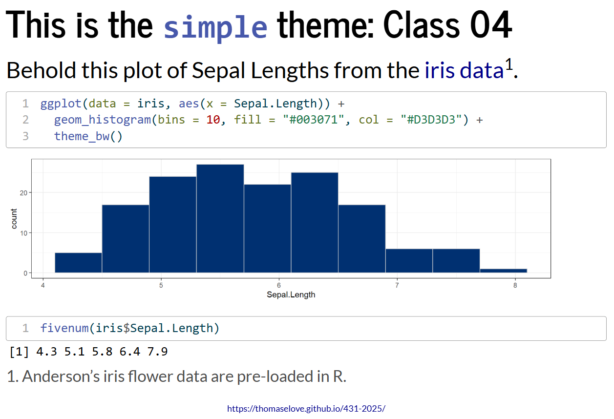
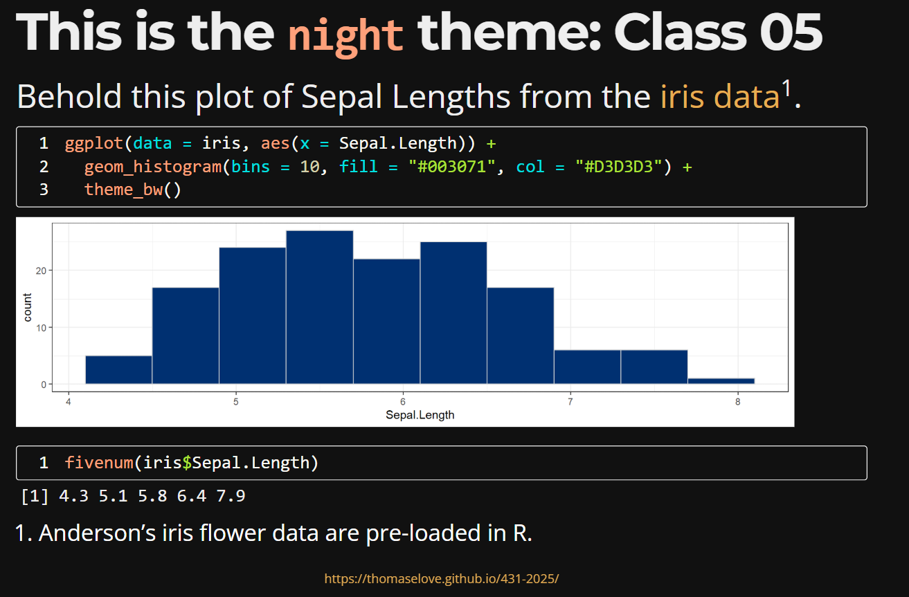

# 431 Class 05: 2025-09-16

[Main Website](https://thomaselove.github.io/431-2025/) | [Calendar](https://thomaselove.github.io/431-2025/calendar.html) | [Syllabus](https://thomaselove.github.io/431-syllabus-2025/) | [Text](https://thomaselove.github.io/431-book/) | [Contact Us](https://thomaselove.github.io/431-2025/contact.html) | [Canvas](https://canvas.case.edu) | [Data and Code](https://github.com/THOMASELOVE/431-data)
:-----------: | :--------------: | :----------: | :---------: | :-------------: | :-----------: | :------------:
for everything | for deadlines | expectations | from Dr. Love | get help | lab submission | for downloads

## Today's Slides

Class | Date | Slides | Word .docx | Quarto .qmd | Recording
:---: | :--------: | :------: | :------: | :------: | :-------------:
05 | 2025-09-16 | **[Slides 05](https://thomaselove.github.io/431-slides-2025/class05.html)** | **[Word 05](https://thomaselove.github.io/431-slides-2025/class05w.docx)** | **[Code 05](https://github.com/THOMASELOVE/431-slides-2025/blob/main/class05.qmd)** | Visit [Canvas](https://canvas.case.edu/), select **Zoom** and **Cloud Recordings**

  [Source](https://phdcomics.com/comics.php?f=462)

## Announcements

1. [Lab 1](https://github.com/THOMASELOVE/431-labs-2025/tree/main/lab1) is due Wednesday 2025-09-17 at Noon. As things stand, **all** assignments for this course are due on Wednesdays at noon. See the [Calendar](https://thomaselove.github.io/431-2025/calendar.html) for the final word in all situations. Submit it to [Canvas](https://canvas.case.edu/).

2. There is a [Minute Paper after Class 05](https://bit.ly/431-2025-minute-05), which will open **by class time**, and which is also due Wednesday 2025-09-17 at Noon.
    - Before you respond, be sure to see the "[One Last Thing](#one-last-thing)" section, below.

3. I fixed a couple of typographical errors that alert students let me know about in the [Class 04 Slides](https://github.com/THOMASELOVE/431-classes-2025/tree/main/class04#todays-slides).
    - If you find such an error during class time, raise your hand and let us know so I can fix it, but outside of class, if you see something, please email me so I can give you a little class participation credit.

4. In [section 14 of our Syllabus](https://thomaselove.github.io/431-syllabus-2025/14_advice.html), I updated a broken link. Here's the repaired version:

> Most people are really bad at meetings, including Professor Love. In a series of tweets, Greg Wilson argued that "...the single most useful training you can give an adult is how to run a meeting and how to participate in someone else's." He then provides [some nice tips in this YouTube video](https://www.youtube.com/watch?v=5f3-q9SzkeE).

5. There is a [new version of RStudio available](https://posit.co/download/rstudio-desktop/) (2025.09.0 build 387 is the one I'm using now.) Feel encouraged to upgrade to this new version.

6. We will begin to post grades (and help you understand how to view and interpret them) after we've graded Lab 1.

7. Lab 2 is due a week from tomorrow, and I updated [the template for Lab 2](https://raw.githubusercontent.com/THOMASELOVE/431-data/refs/heads/main/data/lab2-template.qmd) on our [431-data page](https://github.com/THOMASELOVE/431-data) to include the `MKinfer` package, since I expect you'll want to use that package. The revised [Lab 2 template](https://raw.githubusercontent.com/THOMASELOVE/431-data/refs/heads/main/data/lab2-template.qmd) now includes all packages that I used in preparing the Lab 2 answer sketch.

8. A [quick demonstration](demo_class05.qmd) about one difference between "live coding" and rendering data related to the use of `kable()` or `print_md()`.

## Ten More Interesting/Fun Facts about Students in this semester's 431 class

1. I just went kayaking in Washington state to see bioluminescence.
2. I know some cardistry.
3. I like cooking and baking, but I do not like to have too much sugar.
4. I like rock climbing and if anyone wants to try it out I'd welcome them to try.
5. I love creating short travel videos—last year I made a series about exploring New England in the fall.
6. I am currently learning Spanish and German, and I taught myself to play the Ukulele last year.
7. I love nature and going on hikes!
8. I love soccer!
9. I love to play mahjong
10. I love to watch good television. I recently finished watching The Wire and am currently finishing up with Mad Men.

These come from the Welcome to 431 survey - some more results from that survey [can be found here](https://github.com/THOMASELOVE/431-classes-2025/blob/main/class02/welcome_report.md).

## From Today's Slides

- [Better Health Partnership](https://www.betterhealthpartnership.org/)
- An [overview of janitor functions](https://cran.r-project.org/web/packages/janitor/vignettes/janitor.html)
- New York Mets' [Team Color Codes](https://teamcolorcodes.com/new-york-mets-color-codes/)
- For more on building tables using the `knitr` and `kableExtra` packages, see [this link](https://cran.r-project.org/web/packages/kableExtra/vignettes/awesome_table_in_html.html)
- For more on building tables using the `gt` package: see [this link](https://gt.rstudio.com/)
- [Appendix E of Dr. Love's Course Book](https://thomaselove.github.io/431-book/formulas.html)  provides detailed descriptions of key numerical summaries.
 
-----------

## Reminders (see [the Calendar](https://thomaselove.github.io/431-2025/calendar.html) for the final word on all deadlines)

- Attend [TA office hours](https://thomaselove.github.io/431-2025/contact.html#ta-office-hours) or email us at `431-help at case dot edu` if you need help.    
- [Lab 1](https://github.com/THOMASELOVE/431-labs-2025) is also due tomorrow (Wednesday 2025-09-17) at noon. Submit it to [Canvas](https://canvas.case.edu/).
- The [Minute Paper](https://github.com/THOMASELOVE/431-minute-2025/tree/main) after Class 05 is due Wednesday 2025-09-17 at noon.
- Get started on [Lab 2](https://github.com/THOMASELOVE/431-labs-2025/tree/main/lab2), which is due Wednesday 2025-09-24 at noon. Make sure you grab the [revised version of the Lab 2 template](https://raw.githubusercontent.com/THOMASELOVE/431-data/refs/heads/main/data/lab2-template.qmd).   
- You should also get started (or at least read all of the instructions) for [Project A](https://thomaselove.github.io/431-projectA-2025/). The [Project A Plan](https://thomaselove.github.io/431-projectA-2025/plan.html) is due Wednesday 2025-10-01 at noon.

## One Last Thing

In today's minute paper, I will ask you "Which of these five themes for slides would you prefer Dr. Love to use in 431 for the rest of the semester?" Here they are, in case you want to see larger versions...

