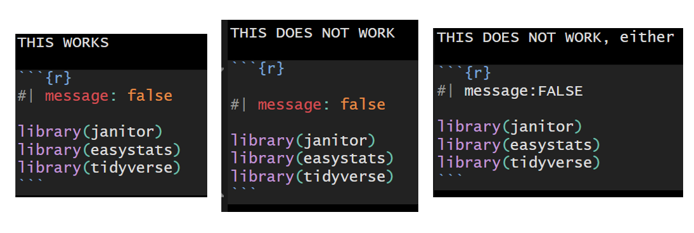

# 431 Class 08: 2025-09-25

[Main Website](https://thomaselove.github.io/431-2025/) | [Calendar](https://thomaselove.github.io/431-2025/calendar.html) | [Syllabus](https://thomaselove.github.io/431-syllabus-2025/) | [Text](https://thomaselove.github.io/431-book/) | [Contact Us](https://thomaselove.github.io/431-2025/contact.html) | [Canvas](https://canvas.case.edu) | [Data and Code](https://github.com/THOMASELOVE/431-data)
:-----------: | :--------------: | :----------: | :---------: | :-------------: | :-----------: | :------------:
for everything | for deadlines | expectations | from Dr. Love | get help | lab submission | for downloads

## Today's Slides

Class | Date | Slides | Word .docx | Quarto .qmd | Recording
:---: | :--------: | :------: | :------: | :------: | :-------------:
08 | 2025-09-25 | **[Slides 08](https://thomaselove.github.io/431-slides-2025/class08.html)** | **[Word 08](https://thomaselove.github.io/431-slides-2025/class08w.docx)** | **[Code 08](https://github.com/THOMASELOVE/431-slides-2025/blob/main/class08.qmd)** | Visit [Canvas](https://canvas.case.edu/), select **Zoom** and **Cloud Recordings**

## Announcements

1. Feedback on the Minute Paper after Class 07 [is now available](https://bit.ly/431-2025-min-07-feedback).
    - Grades below 5 (posted to the Grading Roster) indicate you skipped key questions, or that you didn't complete the minute paper, either on time, or at all.
2. The Answer Sketch for Lab 2 will be posted **WHEN** to our Shared Drive.
3. By now, you should have received your **431 Grading Code** in your CWRU email and should have used it to look up the feedback on Lab 1 we have provided on our Shared Drive. If you are having trouble using the code, contact me.
    - If you have questions about the Answer Sketch for any completed Lab, please address them to myself or the TAs at any time.
    - If you have questions about how many points you received on any question in any Lab, don't bother the TAs. Instead, [follow this link](https://github.com/THOMASELOVE/431-labs-2025/tree/main?tab=readme-ov-file#lab-regrade-requests-will-be-reviewed-in-december) and fill out the [Lab Regrade Request Form](https://github.com/THOMASELOVE/431-labs-2025/tree/main?tab=readme-ov-file#lab-regrade-requests-will-be-reviewed-in-december) before 2025-12-12.
4. I fixed the axis labels in slide 21 (also see the revised code in slide 20) on the comparison boxplot in the [Class 07 Slides](https://thomaselove.github.io/431-slides-2025/class07.html). I fixed the posted [Word version](https://thomaselove.github.io/431-slides-2025/class07w.docx) and [the posted Quarto code](https://github.com/THOMASELOVE/431-slides-2025/blob/main/class07.qmd), too.
5. Remember to come up with [a real title for your Project A Plan submission](https://thomaselove.github.io/431-projectA-2025/plan.html#project-a-plan-title) due next Wednesday 2025-10-01. Read that link.
    - You will save yourself meaningful pain if you read and heed both the [Submission Instructions](https://thomaselove.github.io/431-projectA-2025/plan.html#submission-instructions) for the Plan, and the [checklist we've provided](https://thomaselove.github.io/431-projectA-2025/plan.html#checklist-review-elements-for-the-project-a-plan) that we'll draw from in evaluating your Project A Plan.

## Some R Tips

1. When you want to start a new heading in Quarto, hit enter **twice** to create a blank line, then in the second line, use `# Name of Header` and not `#Name of Header`.
    - To create a new subheader, use `## Name of Subheader`.
    - Note the space between `#` or `##` and your heading, **and** the need for a blank line before a new heading begins.
2. Place a blank line in your code before and after every header, every code chunk, and every paragraph of text to avoid problems.
2. When naming a result (like a model) in R, I would use `fit1` or `m1` as a name, followed by `fit2`, `fit3` and so forth. Another option might be `fit_ols` or `fit_Bayes` if you must, but don't ever name anything `ols` or `lm` or something else that is also a function in R. That will create all kinds of havoc.
3. When loading your R packages in Quarto for 431, silence messages (but not warnings) like this *instead* of any other way...

4. In the date section (usually the third line of your YAML) at the top of any Quarto document for 431, use `date: last-modified` and not `date: 2025-09-25` or anything else.

---------

## Favorite Movies Discussion 1

For today's discussion, [we'll go to this link](https://github.com/THOMASELOVE/431-classes-2025/blob/main/movies/class08.md).

The link above describes some information about the `movies_2025-09-25` Google Sheet now found in our Shared Google Drive. 

- That sheet describes the **51** movies selected as a "favorite movie" by students in 431 in the Fall 2025 version of this course.
    - On Tuesday, we'll be looking at a larger set of data, including "favorite movies" from students in 2020-2024, as well.
- In Class 07, I talked a little bit more about how I developed the data and variable descriptions and sources tabs in the sheet, mostly using [IMDB](https://www.imdb.com/).
- In future classes (starting Tuesday), we'll augment this database in several ways, and we'll develop (and try to explore) some research questions.
- In addition to [IMDB](https://www.imdb.com/), some other sites I have used in the past to gather data about movies include:
    - <https://www.rottentomatoes.com/>, <https://www.flickchart.com/> and <https://the-numbers.com/>
    - **In class 11, I will be looking for you to help me identify other available public sources of interesting movie data, so you might want to give that some thought in spare hours.**

## Reminders (see [the Calendar](https://thomaselove.github.io/431-2025/calendar.html) for the final word on all deadlines)

- Before Class 9 (2025-09-30)
    - Complete the [Project A plan](https://thomaselove.github.io/431-projectA-2025/plan.html), which is due Wednesday 2025-10-01 at noon.
        - As a reminder, remember to come up with [a real title for your Project A Plan submission](https://thomaselove.github.io/431-projectA-2025/plan.html#project-a-plan-title). (I would definitely read that link.)
        - Also, you will save yourself meaningful pain if you read and heed both the [Submission Instructions](https://thomaselove.github.io/431-projectA-2025/plan.html#submission-instructions) for the Plan, and the [checklist we've provided](https://thomaselove.github.io/431-projectA-2025/plan.html#checklist-review-elements-for-the-project-a-plan) that we'll draw from in evaluating your Project A Plan.
    - Read *The Art of Statistics* by David Spiegelhalter, Chapter 7 (we'll read Chapter 6 later, you can read it now if you like)
    - Read [R for Data Science](https://r4ds.hadley.nz/), sections 16 (Factors) and 28 (Quarto)
    - Remember that our class will be (at least partially) video-taped on Tuesday 2025-09-30.
- Attend [TA office hours](https://thomaselove.github.io/431-2025/contact.html#ta-office-hours) or email us at `431-help at case dot edu` if you need help.    
- Think about some potential sources online of interesting movie data. We'll want to hear about those in Class 11.
