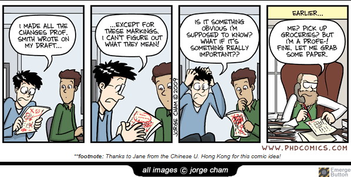

# 431 Class 12: 2025-10-09

[Main Website](https://thomaselove.github.io/431-2025/) | [Calendar](https://thomaselove.github.io/431-2025/calendar.html) | [Syllabus](https://thomaselove.github.io/431-syllabus-2025/) | [Text](https://thomaselove.github.io/431-book/) | [Contact Us](https://thomaselove.github.io/431-2025/contact.html) | [Canvas](https://canvas.case.edu) | [Data and Code](https://github.com/THOMASELOVE/431-data)
:-----------: | :--------------: | :----------: | :---------: | :-------------: | :-----------: | :------------:
for everything | for deadlines | expectations | from Dr. Love | get help | lab submission | for downloads

## Today's Slides

Class | Date | Slides | Word .docx | Quarto .qmd | Recording
:---: | :--------: | :------: | :------: | :------: | :-------------:
12 | 2025-10-09 | **[Slides 12](https://thomaselove.github.io/431-slides-2025/class12.html)** | **[Word 12](https://thomaselove.github.io/431-slides-2025/class12w.docx)** | **[Code 12](https://github.com/THOMASELOVE/431-slides-2025/blob/main/class12.qmd)** | Visit [Canvas](https://canvas.case.edu/), select **Zoom** and **Cloud Recordings**

## Announcements

1. I have completed the description of [How the Project A Plans Were Evaluated](https://github.com/THOMASELOVE/431-classes-2025/blob/main/projectA/plans/evaluation.md). This will also be the approach we take in reviewing Project A Plan revisions.
2. Feedback on the Minute Paper after Class 11 is now available at <https://bit.ly/431-2025-min-11-feedback>.
3. A reminder that in writing a [Quiz](https://github.com/THOMASELOVE/431-quizzes-2025), a key thing I use is the list of responses to "What is the most important thing you've learned recently?" as presented in the [Minute Papers](https://github.com/THOMASELOVE/431-minute-2025) to help me isolate things I want to ask about. I also reread all of your comments and my feedback reported in those [Minute Papers](https://github.com/THOMASELOVE/431-minute-2025) to help identify things I want to check on.

## On Sample Size Requirements for Estimating and Comparing Proportions

- When you are trying to build an estimate of a single population proportion based on a sample of size n which shows a probability p of "yes" (as opposed to "no"), a minimum requirement on np and n(1-p) of 5, or even 10, is important for the confidence intervals generated by `prop.test()`, `binom.test()` and the other methods from Class 11 to make sense. The Agresti-Coull and `saifs_ci()` approaches still do reasonably well if both np and n(1-p) are at least 5.
  - If you have less than 5 observations of either "yes" or "no" and want to estimate the proportion of "yes" responses in a population, your interval won't be very good, no matter what method you use, and I would ask why you'd be trying to do statistical inference to summarize the findings (as opposed to simply writing a sentence listing the counts of "yes" and "no") in that setting anyway. Note that I often do this sort of simple explanatory description in the [Minute Papers](https://github.com/THOMASELOVE/431-minute-2025).
  - An example: "We asked a random sample of 85 people if they agreed with the statement, and 4 of them (4.7%) did."
- For a 2x2 table, we use `twoby2()` from Epi or `twobytwo()` from `Love-431.R` regardless of sample size to get tentative results, but the assumption of a 2x2 table is that you have a reasonable sample size (10 is a better minimum than 5 there) in each cell.
  - If you don't have at least 10 observations in each cell, no statistical method will be accurate (the Fisher exact test, for example, isn't better than the Pearson chi-square (asymptotic) test), and I would ask why you'd be trying to do statistical inference to summarize the findings (as opposed to simply presenting the table of data in a sentence or image of the table) in that setting anyway. Note that I also often do this sort of simple explanatory description in the [Minute Papers](https://github.com/THOMASELOVE/431-minute-2025).
  - An example: "While 36 out of 60 people (60%) who had not shared needles avoided the complication, only 6 of the 20 people who had shared needles (12%) avoided that complication."

## On Non-Parametric (Rank-Based) Tests and Confidence Intervals

If the distribution of data is severely skewed, the Kruskal-wallis test might be used for comparing the locations of multiple groups. What approach can be used for two independent samples where the data are severely skewed?

- The bootstrap could be used, a transformation of the outcome could be used, or a Wilcoxon-Mann-Whitney rank sum test could be used, as described in [Section 6.10](https://thomaselove.github.io/431-book/06_twogroups.html#wilcoxon-rank-sum-test) of our Course Book.
- If we had severe skew in paired differences, we could similarly consider a bootstrap approach or a Wilcoxon signed rank test, as described in [Section 5.7](https://thomaselove.github.io/431-book/05_paired.html#wilcoxon-signed-rank-test) of our book, or a sign test, as described in [Section 5.8](https://thomaselove.github.io/431-book/05_paired.html#sign-test).
- The main problem with all of these methods when building confidence intervals is that they no longer compare means, and they also don't compare medians, so it's hard to interpret their measures of location effectively. As a result, I de-emphasize them in 431.

----------

## Favorite Movies

Here is our [Class 12 activity](https://github.com/THOMASELOVE/431-classes-2025/blob/main/movies/class12.md), which we introduced in Class 11.

Also, I remind you that: A Favorite Movies Update (including analyses of questions posed in Class 09) is now available as [Quarto](https://raw.githubusercontent.com/THOMASELOVE/431-classes-2025/refs/heads/main/movies/movies_update1.qmd) or [HTML](https://github.com/THOMASELOVE/431-classes-2025/blob/main/movies/movies_update1.html) **for download**. You'll also find these files on our Shared Drive as `movies_update1.qmd` and `movies_update1.html`.

## Coming Up

See [the Calendar](https://thomaselove.github.io/431-2025/calendar.html) for all deadlines.

1. For 12 groups, revision of the [Project A Plan](https://github.com/THOMASELOVE/431-classes-2025/tree/main/projectA/plans) is due to [Canvas](https://canvas.case.edu/) tomorrow 2025-10-10 at 10 AM.
2. [Lab 4](https://github.com/THOMASELOVE/431-labs-2025/tree/main/lab4) is due Wednesday 2025-10-15 at noon to [Canvas](https://canvas.case.edu/).
    - The Lab asks questions that you can't really answer without being caught up in the reading of both [R for Data Science](https://r4ds.hadley.nz/), and Spiegelhalter's *The Art of Statistics*.
3. There will also be a Minute Paper after Class 13 due Wednesday 2025-10-15 at noon.
4. [Class 13](https://github.com/THOMASELOVE/431-classes-2025/tree/main/class13) on Tuesday 2025-10-14 is entitled "What's Wrong with Statistical Significance?" It's a tough one to miss, since it's pretty important.
5. You will receive [Quiz 1](https://github.com/THOMASELOVE/431-quizzes-2025/blob/main/README.md) by 3 PM on Thursday 2025-10-16. It is due Wednesday 2025-10-22 at noon. I will discuss logistics of the Quiz with you in class Thursday 2025-10-16 before I make it available.
6. Fall Break (no TA office hours and no 431 class these two days) is Monday and Tuesday 2025-10-20 and 2025-10-21.

## One Last Thing

or ... why I type my feedback now, instead of hand-writing it.

 [Source](https://phdcomics.com/comics/archive.php?comicid=1254)
