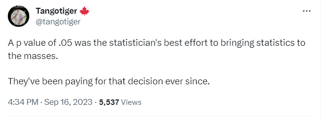
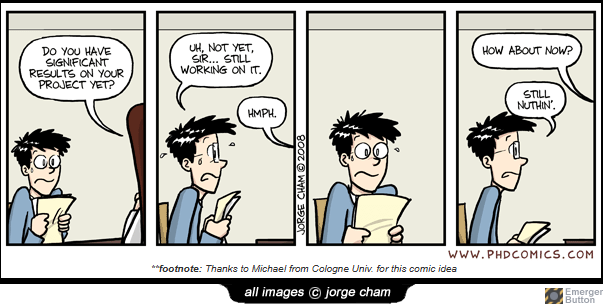

# 431 Class 14: 2025-10-16

[Main Website](https://thomaselove.github.io/431-2025/) | [Calendar](https://thomaselove.github.io/431-2025/calendar.html) | [Syllabus](https://thomaselove.github.io/431-syllabus-2025/) | [Text](https://thomaselove.github.io/431-book/) | [Contact Us](https://thomaselove.github.io/431-2025/contact.html) | [Canvas](https://canvas.case.edu) | [Data and Code](https://github.com/THOMASELOVE/431-data)
:-----------: | :--------------: | :----------: | :---------: | :-------------: | :-----------: | :------------:
for everything | for deadlines | expectations | from Dr. Love | get help | lab submission | for downloads

## Today's Slides

Class | Date | Slides | Word .docx | Quarto .qmd | Recording
:---: | :--------: | :------: | :------: | :------: | :-------------:
14 | 2025-10-16 | **[Slides 14](https://thomaselove.github.io/431-slides-2025/class14.html)** | **[Word 14](https://thomaselove.github.io/431-slides-2025/class14w.docx)** | **[Code 14](https://github.com/THOMASELOVE/431-slides-2025/blob/main/class14.qmd)** | Visit [Canvas](https://canvas.case.edu/), select **Zoom** and **Cloud Recordings**

## Announcements

1. Some [Quiz 1 information](https://github.com/THOMASELOVE/431-quizzes-2025/tree/main/quiz1) is now available.
    - The remainder will appear [on the Quiz 1 page](https://github.com/THOMASELOVE/431-quizzes-2025/tree/main/quiz1) at 3 PM Thursday 2025-10-16. 
2. The [Lab 4](https://github.com/THOMASELOVE/431-labs-2025/tree/main/lab4) answer sketch and grading rubric is now in our Shared Drive. Grades and detailed feedback will be posted after the Quiz.
3. [Here is my Feedback](https://bit.ly/431-2025-min-13-feedback) on the Minute Paper after Class 13.

## Today's First Activity

We'll watch [So, What's A P-Value?](https://www.facebook.com/watch/?v=1014409165269579) at the start of class today, I hope. 

This video was originally part of [Not Even Scientists Can Easily Explain P-values](https://fivethirtyeight.com/features/not-even-scientists-can-easily-explain-p-values/) published 2015-11-24 by Christie Aschwanden at the now-dead 538 website. Here's the start of that piece:

> P-values have taken quite a beating lately. These widely used and commonly misapplied statistics have been blamed for giving a [veneer of legitimacy to dodgy study results](https://fivethirtyeight.com/features/ignore-the-headlines-we-dont-know-if-e-cigs-lead-kids-to-real-cigs/), encouraging [bad research practices](https://fivethirtyeight.com/features/science-isnt-broken/#part2) and promoting [false-positive study results](https://fivethirtyeight.com/features/psychology-is-starting-to-deal-with-its-replication-problem/).

> But after writing about p-values again and again, and recently issuing a correction on a [nearly year-old story](https://fivethirtyeight.com/features/we-may-never-know-how-well-cloud-seeding-works/) over some erroneous information regarding a study's p-value (which I’d taken from the scientists themselves and their report, I’ve come to think that the most fundamental problem with p-values is that no one can really say what they are.

> Last week, I attended the inaugural [METRICS conference at Stanford](http://metrics.stanford.edu/), which brought together some of the world’s leading experts on meta-science, or the study of studies. I figured that if anyone could explain p-values in plain English, these folks could. I was wrong.

## Favorite Movies Survey

I have posted a "[Favorite Movies Survey](https://bit.ly/431-2025-movies-survey)". This (admittedly tedious) survey is required of all 431 students, and you will receive a couple of points of class participation credit for completing it. There are five questions, each with about 10 movies listed. Please complete this survey before **10 AM on Friday 2025-10-24**.

## One Last Thing

