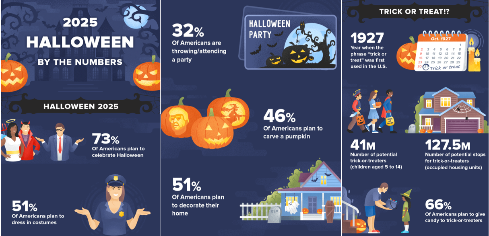

# 431 Class 17: 2025-10-30

[Main Website](https://thomaselove.github.io/431-2025/) | [Calendar](https://thomaselove.github.io/431-2025/calendar.html) | [Syllabus](https://thomaselove.github.io/431-syllabus-2025/) | [Text](https://thomaselove.github.io/431-book/) | [Contact Us](https://thomaselove.github.io/431-2025/contact.html) | [Canvas](https://canvas.case.edu) | [Data and Code](https://github.com/THOMASELOVE/431-data)
:-----------: | :--------------: | :----------: | :---------: | :-------------: | :-----------: | :------------:
for everything | for deadlines | expectations | from Dr. Love | get help | lab submission | for downloads

## Today's Slides

Class | Date | Slides | Word .docx | Quarto .qmd | Recording
:---: | :--------: | :------: | :------: | :------: | :-------------:
17 | 2025-10-30 | **[Slides 17](https://thomaselove.github.io/431-slides-2025/class17.html)** | **[Word 17](https://thomaselove.github.io/431-slides-2025/class17w.docx)** | **[Code 17](https://github.com/THOMASELOVE/431-slides-2025/blob/main/class17.qmd)** | Visit [Canvas](https://canvas.case.edu/), select **Zoom** and **Cloud Recordings**

## Happy Halloween

- Excerpt from [Halloween Facts Infographic: Spooky Stats for 2025](https://wallethub.com/blog/halloween-facts/25374) by John S. Kiernan.

## Announcements

1. Feedback on the Minute Paper after Class 16 will appear **by class time**.
2. The [Project B instructions](https://thomaselove.github.io/431-projectB-2025/) are now available.

----

## References related to Multiple Imputation and Today's Slides

- Sterne JAC et al [Multiple imputation for missing data in epidemiological and clinical research: potential and pitfalls](https://www.bmj.com/content/338/bmj.b2393) BMJ 2009; 338:b2393.
- [Flexible Imputation of Missing Data, 2nd edition](https://stefvanbuuren.name/fimd/) by Stef Van Buuren
- The mice (Multivariate Imputation by Chained Equations) package [reference page](https://amices.org/mice/).
    - Stef van Buuren, Karin Groothuis-Oudshoorn (2011). [mice: Multivariate Imputation by Chained Equations in R](https://www.jstatsoft.org/article/view/v045i03). Journal of Statistical Software, 45(3), 1-67. DOI 10.18637/jss.v045.i03.
- Heymans MW and Eekhout I [Applied Missing Data Analysis with SPSS and RStudio](https://bookdown.org/mwheymans/bookmi/)
- The `mipo` (Multiple Imputation pooled object) help file [can be found here](https://rdrr.io/cran/mice/man/mipo.html).
- [Getting Started with Multiple Imputation in R](https://library.virginia.edu/data/articles/getting-started-with-multiple-imputation-in-r)
- [Multiple Imputation with the mice package](https://rmisstastic.netlify.app/tutorials/erler_course_multipleimputation_2018/erler_practical_mice_2018)

## The gt package

- <https://gt.rstudio.com/> is the main source for the package

> The gt philosophy: we can construct a wide variety of useful tables with a cohesive set of table parts. These include the table header, the stub, the column labels and spanner column labels, the table body, and the table footer.

## The glue package

- <https://glue.tidyverse.org/> is the main place to go for more information

## There are 12 Remaining Deliverables for 431 This Semester

As things stand, here is the complete list. See the [Course Calendar](https://thomaselove.github.io/431-2025/calendar.html) for more details, and updates will appear there, if needed. All dates are **WEDNESDAYS**, unless indicated otherwise.

Deadline | Item(s)
:-----------------: | :----------------------------------------------------------------------------------------------------------
2025-11-05 at noon | (1) [Lab 5](https://github.com/THOMASELOVE/431-labs-2025/tree/main/lab5) is due to [Canvas](https://canvas.case.edu/).   (2) [Minute Paper after Class 18](https://github.com/THOMASELOVE/431-minute-2025) (*to appear*)
2025-11-12 at noon | (3) Project B registration and scheduling form will be due. (Google Form)   **Project B instructions** should be available by 2025-11-01.   (4) [Minute Paper after Class 20](https://github.com/THOMASELOVE/431-minute-2025) (*to appear*)
2025-11-19 at noon | (5) [Lab 6](https://github.com/THOMASELOVE/431-labs-2025/tree/main/lab6) is due to [Canvas](https://canvas.case.edu/).   (6) [Minute Paper after Class 22](https://github.com/THOMASELOVE/431-minute-2025) (*to appear*)
2025-12-03 at noon | (7) [Quiz 2](https://github.com/THOMASELOVE/431-quizzes-2025/tree/main/quiz2) is due (Google Form).   [Quiz 2](https://github.com/THOMASELOVE/431-quizzes-2025/tree/main/quiz2) will be made available to you by 3 PM on Thursday 2025-11-20.
30 minutes on   December   3, 4, 5, 8 or 9 | (8) Project B presentation with me (either in person or over Zoom)   You will express your schedule preferences as part of the Project B registration form.   The presentation schedule will be posted on 2025-11-14.
2025-12-10 at noon | (9) **Final Deadline**: All Project B Materials are due.   (10) [Lab X](https://github.com/THOMASELOVE/431-labs-2025/tree/main/labX) is due.   (optional) (11) [Lab Regrade Request Form](https://bit.ly/431-2025-lab-regrade-request) is due.
Around December 10 | (12) Course Evaluation of 431 for CWRU (exact date and web link TBA)

**Note**: There will also be at least two more opportunities for bonus credit this semester - each of which will have deadlines after the Thanksgiving Break. So far, one has been published.
