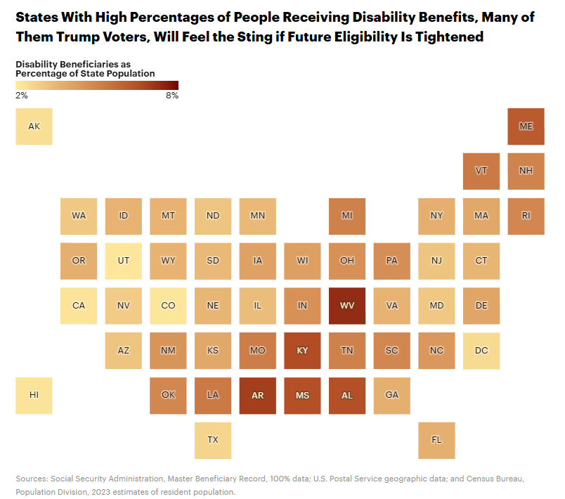

# 431 Class 21: 2025-11-13

[Main Website](https://thomaselove.github.io/431-2025/) | [Calendar](https://thomaselove.github.io/431-2025/calendar.html) | [Syllabus](https://thomaselove.github.io/431-syllabus-2025/) | [Text](https://thomaselove.github.io/431-book/) | [Contact Us](https://thomaselove.github.io/431-2025/contact.html) | [Canvas](https://canvas.case.edu) | [Data and Code](https://github.com/THOMASELOVE/431-data)
:-----------: | :--------------: | :----------: | :---------: | :-------------: | :-----------: | :------------:
for everything | for deadlines | expectations | from Dr. Love | get help | lab submission | for downloads

## Today's Slides

Class | Date | Slides | Word .docx | Quarto .qmd | Recording
:---: | :--------: | :------: | :------: | :------: | :-------------:
21 | 2025-11-13 | **[Slides 21](https://thomaselove.github.io/431-slides-2025/class21.html)** | **[Word 21](https://thomaselove.github.io/431-slides-2025/class21w.docx)** | **[Code 21](https://github.com/THOMASELOVE/431-slides-2025/blob/main/class21.qmd)** | Visit [Canvas](https://canvas.case.edu/), select **Zoom** and **Cloud Recordings**

 [Source](https://xkcd.com/3101)

## Announcements

1. Project B Registration status is [available here](https://github.com/THOMASELOVE/431-classes-2025/blob/main/projectB/registration.md).
    - All but one project B plan is now approved.
2. The Project B presentation schedule is also [available now](https://github.com/THOMASELOVE/431-classes-2025/blob/main/projectB/schedule.md).
3. Feedback on the Minute Paper after Class 20 will be available **by class time**
4. More to come. 

## References from the Slides

- Gelman Andrew (2008) [Scaling regression inputs by dividing by two standard deviations](https://pubmed.ncbi.nlm.nih.gov/17960576/) *Statistics in Medicine* 27(15): 2865-73.

---

## Taking Other Courses With Me

In addition to 431, I teach two other semester-long courses, called **PQHS 432** and **PQHS 500**. I will teach both 432 and 500 in Spring 2026. My advice on these courses is found [in the Class 18 README](https://github.com/THOMASELOVE/431-classes-2025/tree/main/class18#taking-other-courses-with-me).

---

## Previous Notes on Project B (also [available here](https://github.com/THOMASELOVE/431-classes-2025/blob/main/projectB/README.md))

1. The count of complete cases we ask for is across **ALL** your variables to be used in Study 2, not just the outcome and key predictor. Be sure to get this right, including properly treating Refused and Don't Know as missing in all variables before making your count.
2. If you have more than the maximum allowable number of observations (10,000 for Non-NHANES studies, and 7,500 for NHANES studies), I encourage you to either (a) focus on a single sex (either females only or males only), or restrict the age range, or apply some other simply explained inclusion criterion that focuses your sample down below the maximum (maybe to about 4,000 subjects), or (b) *a less good solution* take a random sample of, say, 4,000 complete cases from your sample.
3. Anyone working with **NHANES** data should have an age restriction, either to **adults** (which can be ages 21-79 or 18-79 or some smaller group within that range) or **children** (which should be determined depending on how the data are gathered, and include only people under a certain age - and perhaps above one, too, like 6 to 17 years old, for example) **or** provide me with a good reason as to why I should let you use some sort of mixed group including both adults and kids.
4. For **NHANES** studies, if you get names instead of numbers in your categorical variables when using the `nhanes()` function in the **nhanesA** package, you can either work with those names, or try adding `translated = FALSE`, as in `demo <- nhanes("DEMO_L", translated = FALSE)` to your call to the `nhanes()` function.

---

## There are 8 Remaining Deliverables for 431 This Semester

As things stand, here is the complete list. See the [Course Calendar](https://thomaselove.github.io/431-2025/calendar.html) for more details, and updates will appear there, if needed. All dates are **WEDNESDAYS**, unless indicated otherwise.

Deadline | Item(s)
:-----------------: | :----------------------------------------------------------------------------------------------------------
2025-11-19 at noon | (1) [Lab 6](https://github.com/THOMASELOVE/431-labs-2025/tree/main/lab6) is due to [Canvas](https://canvas.case.edu/).   (2) [Minute Paper after Class 22](https://github.com/THOMASELOVE/431-minute-2025) (*to appear*)
2025-12-03 at noon | (3) [Quiz 2](https://github.com/THOMASELOVE/431-quizzes-2025/tree/main/quiz2) is due (Google Form).   [Quiz 2](https://github.com/THOMASELOVE/431-quizzes-2025/tree/main/quiz2) will be made available to you by 3 PM on Thursday 2025-11-20.
~30 minutes on   December   3, 4, 5, 8 or 9 | (4) [Project B](https://thomaselove.github.io/431-projectB-2025/) presentation with me (either in person or over Zoom)   The [Project B presentation schedule is here](https://github.com/THOMASELOVE/431-classes-2025/blob/main/projectB/schedule.md).
2025-12-10 at noon | (5) **Final Deadline**: All [Project B](https://thomaselove.github.io/431-projectB-2025/) Materials are due.   (6) [Lab X](https://github.com/THOMASELOVE/431-labs-2025/tree/main/labX) is due.   (optional) (7) [Lab Regrade Request Form](https://bit.ly/431-2025-lab-regrade-request) is due.
Around December 10 | (8) Course Evaluation of 431 for CWRU (exact date and web link TBA)

**Note**: There will also be two or three more opportunities for bonus credit this semester - each of which will have deadlines after the Thanksgiving Break. So far, one has been published, and another will be published before Thanksgiving Break.

--- 

## One Last Thing

- from [Red State Workers Could Lose Out on Disability Benefits as Trump Administration Rewrites Eligibility Rules](https://www.propublica.org/article/social-security-disability-eligibility-trump-red-states) by Eli Hager at Propublica, 2025-10-31.

