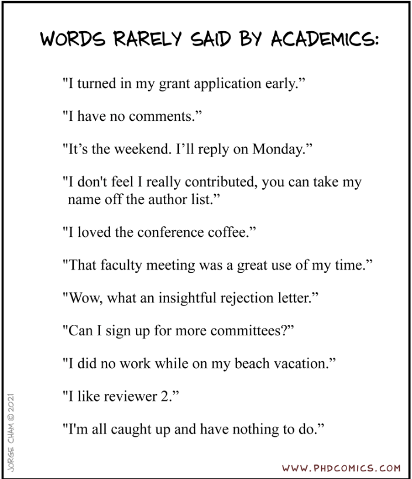

# 431 Class 22: 2025-11-18

[Main Website](https://thomaselove.github.io/431-2025/) | [Calendar](https://thomaselove.github.io/431-2025/calendar.html) | [Syllabus](https://thomaselove.github.io/431-syllabus-2025/) | [Text](https://thomaselove.github.io/431-book/) | [Contact Us](https://thomaselove.github.io/431-2025/contact.html) | [Canvas](https://canvas.case.edu) | [Data and Code](https://github.com/THOMASELOVE/431-data)
:-----------: | :--------------: | :----------: | :---------: | :-------------: | :-----------: | :------------:
for everything | for deadlines | expectations | from Dr. Love | get help | lab submission | for downloads

## Today's Slides

Class | Date | Slides | Word .docx | Quarto .qmd | Recording
:---: | :--------: | :------: | :------: | :------: | :-------------:
22 | 2025-11-18 | **[Slides 22](https://thomaselove.github.io/431-slides-2025/class22.html)** | **[Word 22](https://thomaselove.github.io/431-slides-2025/class22w.docx)** | **[Code 22](https://github.com/THOMASELOVE/431-slides-2025/blob/main/class22.qmd)** | Visit [Canvas](https://canvas.case.edu/), select **Zoom** and **Cloud Recordings**

 [Source](https://phdcomics.com/comics/archive.php?comicid=2048)

## Announcements

1. Today's Data Source is [NHANES 2013-14](https://wwwn.cdc.gov/nchs/nhanes/continuousnhanes/default.aspx?BeginYear=2013)
2. The [Project B Presentation Schedule is here](https://github.com/THOMASELOVE/431-classes-2025/blob/main/projectB/schedule.md).
3. [Creating simulated data sets in R](https://stirlingcodingclub.github.io/simulating_data/index.html) by Brad Duthie might be of some interest to you who wonder how I simulate class examples from existing real data. This isn't exactly what I do (among other things, I use the tidyverse more) but it's close and more generally applicable than my method.
4. More to come.

---

## Reminders

## Taking Other Courses With Me

In addition to 431, I teach two other semester-long courses, called **PQHS 432** and **PQHS 500**. I will teach both 432 and 500 in Spring 2026. My advice on these courses is found [in the Class 18 README](https://github.com/THOMASELOVE/431-classes-2025/tree/main/class18#taking-other-courses-with-me).

## There are 8 Remaining Deliverables for 431 This Semester

As things stand, here is the complete list. See the [Course Calendar](https://thomaselove.github.io/431-2025/calendar.html) for more details, and updates will appear there, if needed. All dates are **WEDNESDAYS**, unless indicated otherwise.

Deadline | Item(s)
:-----------------: | :----------------------------------------------------------------------------------------------------------
2025-11-19 at noon | (1) [Lab 6](https://github.com/THOMASELOVE/431-labs-2025/tree/main/lab6) is due to [Canvas](https://canvas.case.edu/).   (2) [Minute Paper after Class 22](https://github.com/THOMASELOVE/431-minute-2025) (*to appear*)
2025-12-03 at noon | (3) [Quiz 2](https://github.com/THOMASELOVE/431-quizzes-2025/tree/main/quiz2) is due (Google Form).   [Quiz 2](https://github.com/THOMASELOVE/431-quizzes-2025/tree/main/quiz2) will be made available to you by 3 PM on Thursday 2025-11-20.
~30 minutes on   December   3, 4, 5, 8 or 9 | (4) [Project B](https://thomaselove.github.io/431-projectB-2025/) presentation with me (either in person or over Zoom)   The [Project B presentation schedule is here](https://github.com/THOMASELOVE/431-classes-2025/blob/main/projectB/schedule.md).
2025-12-10 at noon | (5) **Final Deadline**: All [Project B](https://thomaselove.github.io/431-projectB-2025/) Materials are due.   (6) [Lab X](https://github.com/THOMASELOVE/431-labs-2025/tree/main/labX) is due.   (optional) (7) [Lab Regrade Request Form](https://bit.ly/431-2025-lab-regrade-request) is due.
Around December 10 | (8) Course Evaluation of 431 for CWRU (exact date and web link TBA)

**Note**: There will also be two or three more opportunities for bonus credit this semester - each of which will have deadlines after the Thanksgiving Break. So far, one has been published, and another will be published before Thanksgiving Break.

--------
